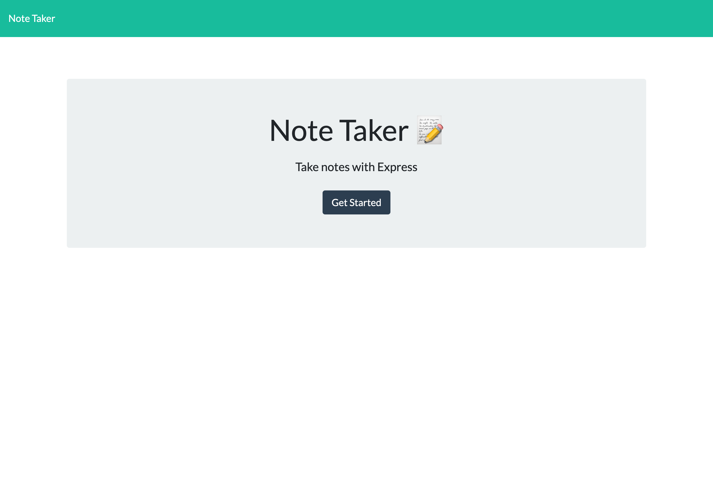
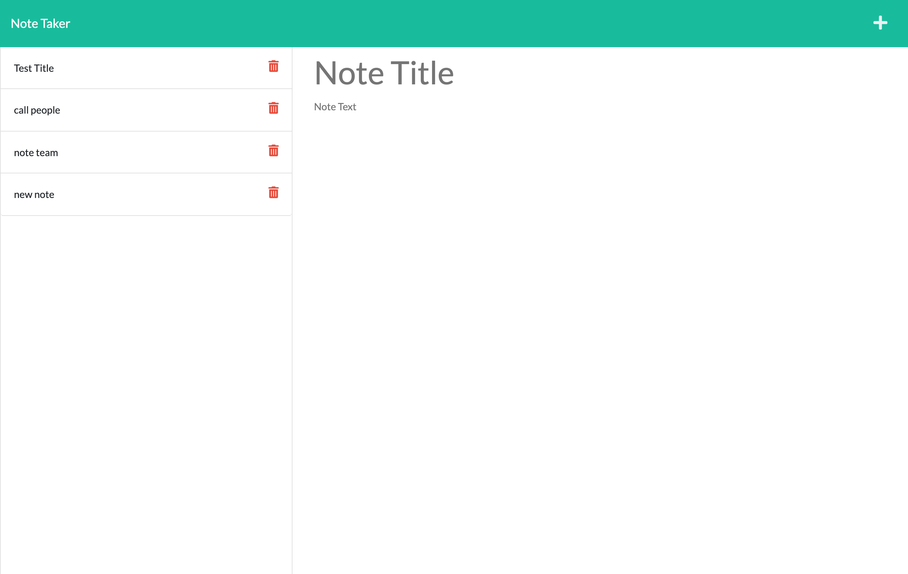

# Note-Taker
 deployed with Heroku https://shrouded-badlands-02817.herokuapp.com

## Description
 C.R.U.D. app that allows you to make notes and then retrieve/save/deletethem to/from a file. just remember to refresh the page after the new note is added in order to view the new note 

 
             
## Table of Contents
          
 - [Installation](#installation)
 - [Usage](#usage)
 - [Credits](#credits)
 - [License](#license)
 - [Questions](#quesions)
      
## Installation
deployed with Heroku just go to: https://shrouded-badlands-02817.herokuapp.com
      
## Usage

## Credits
 Penn Coding BootCamp
      
## License
 MIT License

Copyright (c) 2022
    
Permission is hereby granted, free of charge, to any person obtaining a copy
of this software and associated documentation files (the "Software"), to deal
in the Software without restriction, including without limitation the rights
to use, copy, modify, merge, publish, distribute, sublicense, and/or sell
copies of the Software, and to permit persons to whom the Software is
furnished to do so, subject to the following conditions:
   
The above copyright notice and this permission notice shall be included in all
copies or substantial portions of the Software.
    
THE SOFTWARE IS PROVIDED "AS IS", WITHOUT WARRANTY OF ANY KIND, EXPRESS OR
IMPLIED, INCLUDING BUT NOT LIMITED TO THE WARRANTIES OF MERCHANTABILITY,
FITNESS FOR A PARTICULAR PURPOSE AND NONINFRINGEMENT. IN NO EVENT SHALL THE
AUTHORS OR COPYRIGHT HOLDERS BE LIABLE FOR ANY CLAIM, DAMAGES OR OTHER
LIABILITY, WHETHER IN AN ACTION OF CONTRACT, TORT OR OTHERWISE, ARISING FROM,
OUT OF OR IN CONNECTION WITH THE SOFTWARE OR THE USE OR OTHER DEALINGS IN THE
SOFTWARE.
            
## Badges

      
## Features
  - Complete C.R.U.D. functionality 
  - Edits a database file depending on the type of request made 
 
## How to Contribute
 https://github.com/Rayman244/Team-Generator

      
## Tests
 No errors to report
  
 ## Questions
 message me on Github https://github.com/Rayman244/
 email me at [rayhewitt42@icloud.com](mailto:rayhewitt42@icloud.com)
 